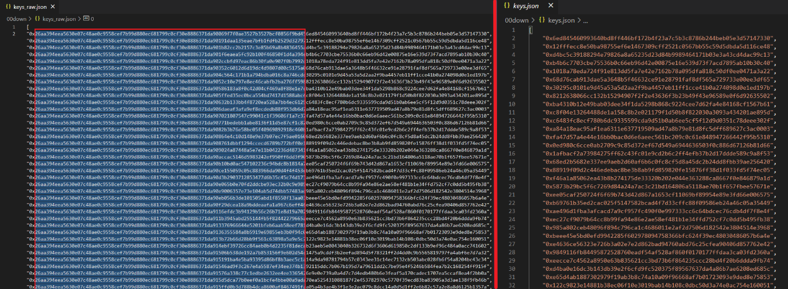
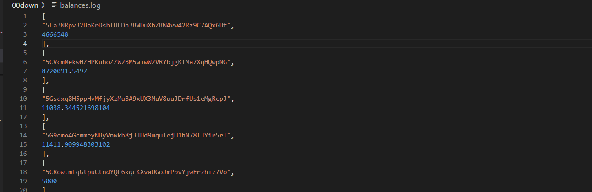
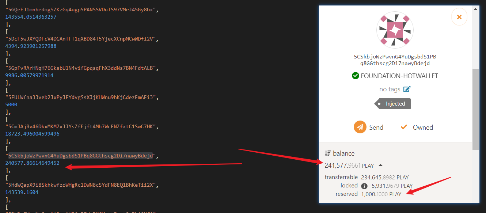

# Snapshot For Substrate

[中文介绍](https://github.com/playdog-io/snapshot4substrate/blob/main/README_zh.md)

***

You can use this tool to quickly retrieve all account address balances on a substrate chain with only one node data, making it easy to restart a test chain or a tiny chain based on the balance information  **(You can restart a chain periodically, reducing node capacity requirements and thus reducing chain maintenance costs).**  If you want to understand the specific principle, you can refer to this article: https://www.shawntabrizi.com/substrate/transparent-keys-in-substrate
***
## steps
1   
```
git clone https://github.com/playdog-io/snapshot4substrate.git
cd snapshot4substrate
yarn install

```

2  
```
curl -H "Content-Type: application/json" -d '{"id":1, "jsonrpc":"2.0", "method": "state_getKeys", "params": ["0x26aa394eea5630e07c48ae0c9558cef7b99d880ec681799c0cf30e8886371da9"]}' http://localhost:1234 > keys_raw.json
```
Execute the above command on the server where the node is running, noting that 1234 should replaced with the RPC port of the node.  

3  

As shown in the picture, keep the left "0x" and the right 64 chars. But delete the chars in middle. Get a new file named it keys.json.

4    
modify snapshot.js:  
a, paste the keys.json content after "var = hex".   
b, replace wss://rpc.subplay.xyz with your chain's wss endpoint.   
c, replace the 448 with the total amount of keys in keys.json - 1.    
d, note that the line 465 should modify according to your chain's tokenDecimals.

5    

Execute: node snapshot.js > balances.log, wait a moment and get the file as shown in the figure. You can read all accounts' balance on that now.

The above data is easy to read. But if you need to restart a chain, annotate the line 465 and unannotate the line 466. Then put the data you got to the customSpec.json. Then you can restart a chain by that file.

***


**Please note the this way we get the balance that sum the locked and unlocked token. But it won't count the token which accounts pledged to get their online name.**
***
If you want to buy me a beer or buy me some tons of beers, you can send any amount of DOT to the address below.
 
14V6J6nH9sEwW9TgZ7mPccontHj8eJRM7hAq1WR5xPfvCfZa

