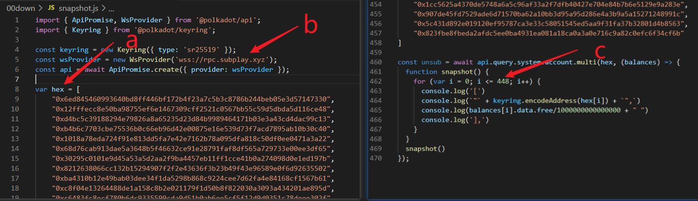

# Substrate快照工具

[English version](https://github.com/playdog-io/snapshot4substrate/blob/main/README_zh.md)

只需拥有一个节点数据，就能使用此工具快速获取一条substrate链上的所有账户地址余额，从而可以很轻松的根据余额信息重启一条测试链或小型链 **（可以定期重启，降低节点容量需求，从而降低链的维护成本）。**如你想了解具体原理，可以参考此文章：https://www.shawntabrizi.com/substrate/transparent-keys-in-substrate
***
## 使用步骤

1   
```
git clone https://github.com/playdog-io/snapshot4substrate.git
cd snapshot4substrate
yarn install

```

2  
```
curl -H "Content-Type: application/json" -d '{"id":1, "jsonrpc":"2.0", "method": "state_getKeys", "params": ["0x26aa394eea5630e07c48ae0c9558cef7b99d880ec681799c0cf30e8886371da9"]}' http://localhost:1234 > keys_raw.json
```
在运行节点的服务器上执行以上命令，注意1234替换为节点的rpc端口。

3  

左图所示，将得到的如左图所示的keys_raw.json文件的所有字段保留左侧的0x和右侧的共64个字符，删掉中间的所有字符。得到如右图所示的keys.json文件。


4    

编辑snapshot.js文件：  
a，将之得到的keys.json文件复制粘贴到var = hex后。   
b，将wss://rpc.subplay.xyz 替换为目标链的wss接口。    
c，将for循环中的数字448替换为keys.json中的条目总数-1。    
d，注意在第465行代码里根据你启动链的代币精度调整此数据。

5    

执行node snapshot.js > balances.log，稍等片刻后手动ctrl+c结束命令得到如图所示的balances.log文件，即可清楚的查看各余额数据。

以上得到的数据利于阅读。如你需要重启一条链，请将第4-d步的 / 1000000000000000删除，再将得到的数据粘贴进customSpec.json即可。

***


**请注意，此方法得到的余额数据包括锁定的和未锁定的代币的总和，不包括因创建链上名称而抵押的代币。**